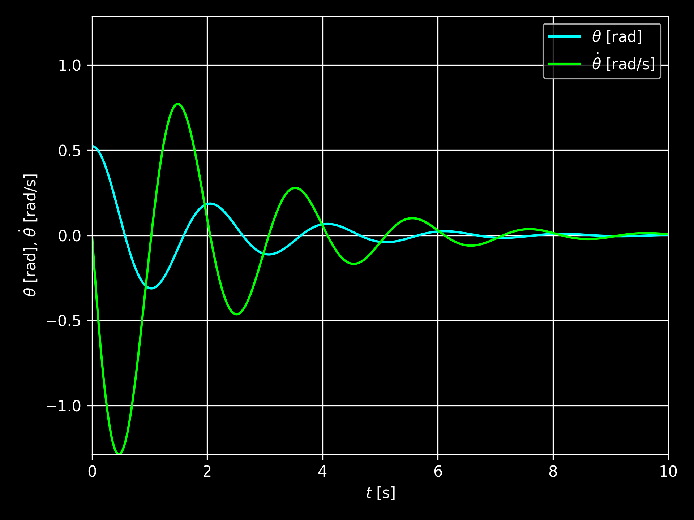

# Nonlinear Pendulum

The simple pendulum is a simple example of a nonlinear ODE in physics.

I consider how traditional numerical methods and physics informed neural networks (PINNs) can be used to solve the equation of motion of a pendulum of length $l$ damped by linear air resistance with coefficient $b$ for the angle $\theta(t)$.

The equation of motion of the mass can be derived using Newtonian mechanics.

$$\sum F_r = T - mg\cos\theta = ml\dot{\theta}^2$$

$$\sum F_\theta = -mg\sin\theta - bl\dot{\theta} = ml\ddot{\theta}$$

$$\ddot{\theta} = -\frac{g}{l} \sin\theta - \frac{b}{m} \dot{\theta}$$

This equation of motion can be solved for $\theta(t)$ given the physical constants in the equation of motion, $\theta(0) = \theta_0$ and $\dot{\theta}(0) = \omega_0$.

## Numerical Method

Nonlinear ODEs can be solved using numerical methods such as the fourth order Runge-Kutta method (RK4). This method enables the solution of first order initial value problems i.e. $y'(t) = f(t, y(t))$.

The equation of motion can be transformed into a first order ODE system.

$$\frac{d}{dt} \begin{bmatrix} \theta \\ \omega \end{bmatrix} = \begin{bmatrix} \omega \\ -\frac{g}{l} \sin\theta - \frac{b}{m} \omega \end{bmatrix}$$

with initial conditions $\theta(0) = \theta_0$ and $\omega(0) = \omega_0$

The numerical solution is shown below, and will be assumed to be the ground truth.

## Physics Informed Neural Network

The universal approximation theorem states that a neural network can be trained to approximate the solution to the equation of motion for given initial conditions and parameters.

$$NN(t; \Theta) \approx \theta(t)$$

Here, $\Theta$ represents the weights and biases of the neural network.

I use a neural network with one input layer ($t$), six hidden layers of width 20, and one output layer ($\theta$).

The PINN is trained with the following loss function, which consists of a boundary loss terms $L_\theta$ and $L_\omega$ (which enforces the initial conditions), and a physics loss term $L_p$ (which enforces the equation of motion at a set of uniformly spaced collocation points $\{t_i\}$ over the domain).

$$L_\theta(\Theta) = \left(NN(0; \Theta) - \theta_0\right)^2$$

$$L_\omega(\Theta) = \left(\frac{dNN}{dt}(0; \Theta) - \omega_0\right)^2$$

$$L_p(\Theta) = \frac{1}{N} \sum_{i = 1}^N \left(\frac{d^2NN}{dt}(t_i; \Theta) + \frac{b}{m} \frac{dNN}{dt}(t_i; \Theta)+ \frac{g}{l} \sin\left(NN(t_i; \Theta)\right) \right)^2$$

$$L(\Theta) = L_\theta(\Theta) + \lambda_1 L_\omega(\Theta) + \lambda_2 L_p(\Theta)$$

This loss function was taken from the [ETH Zurich Deep Learning in Scientific Computing course (2023)](https://camlab.ethz.ch/teaching/deep-learning-in-scientific-computing-2023.html).

Initially, the parameters $\lambda_1$ and $\lambda_2$ were set to 1 and 0.1 respectively as the PINN converged relatively reliably using these values.

The PINN's weights and biases are initialised using Xavier initialisation and optimised using the Adam optimiser.

The loss curve and solution when the PINN is trained with 80 collocation points for computing the physics loss for 10,000 epochs are shown below. The PINN converges to the ground truth quite well when the oscillations are large, but is less accurate when the oscillations become smaller.

The training process can be visualised.

